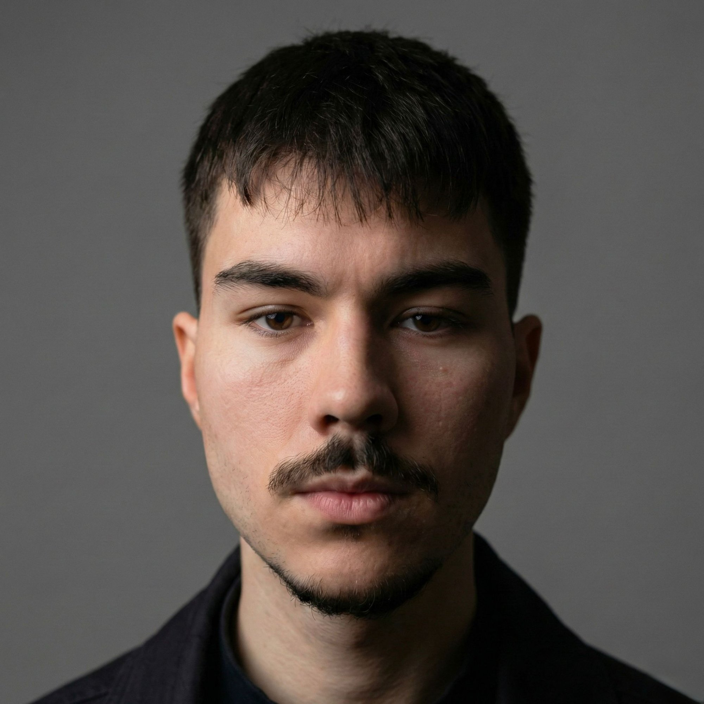

# 🖼️ Guía de Optimización de Imágenes

## 📸 Optimizar profile.jpg

Tu imagen `profile.jpg` puede ser optimizada para mejorar el rendimiento del sitio.

### **Opción 1: Herramientas Online (Más Fácil)**

#### **TinyPNG / TinyJPG** ⭐ Recomendado
1. Ve a [tinypng.com](https://tinypng.com/)
2. Arrastra `profile.jpg`
3. Descarga la versión comprimida
4. Reemplaza el archivo original

**Reducción típica:** 50-70% del tamaño sin pérdida visual

---

#### **Squoosh** (Google)
1. Ve a [squoosh.app](https://squoosh.app/)
2. Carga `profile.jpg`
3. Ajusta la calidad (recomendado: 80-85)
4. Selecciona formato:
   - **WebP** - Mejor compresión, soportado por navegadores modernos
   - **JPEG** - Máxima compatibilidad
5. Descarga

---

### **Opción 2: Convertir a WebP (Mejor Performance)**

WebP es hasta 30% más liviano que JPEG con la misma calidad.

#### **Con Squoosh:**
1. Abre [squoosh.app](https://squoosh.app/)
2. Carga `profile.jpg`
3. En "Compress", selecciona **WebP**
4. Ajusta calidad a 80-85
5. Descarga como `profile.webp`

#### **Actualizar HTML:**
Reemplaza en index.html línea ~106:

```html
<!-- Antes -->


<!-- Después (con fallback) -->
<picture>
    <source srcset="profile.webp" type="image/webp">
    
</picture>
```

---

### **Opción 3: Usar Herramienta de Línea de Comandos**

Si tienes Node.js instalado:

```powershell
# Instalar sharp (herramienta de optimización)
npm install -g sharp-cli

# Convertir a WebP
sharp -i profile.jpg -o profile.webp --webp-quality 85

# Optimizar JPEG
sharp -i profile.jpg -o profile-optimized.jpg --jpeg-quality 85
```

---

## 📊 Tamaños Recomendados

Para `profile.jpg`:
- **Ancho máximo:** 1000px (actualmente se muestra a 500px, pero 2x para pantallas Retina)
- **Formato:** WebP con fallback a JPEG
- **Calidad:** 80-85
- **Tamaño objetivo:** <150KB

---

## 🚀 Otras Optimizaciones de Imagen

### **1. Lazy Loading** ✅ **YA IMPLEMENTADO**
```html

```

### **2. Width/Height** ✅ **YA IMPLEMENTADO**
```html

```
Evita layout shift durante la carga.

### **3. Responsive Images (Futuro)**
Si necesitas diferentes tamaños para móvil/desktop:

```html
<picture>
    <source media="(max-width: 768px)" srcset="profile-mobile.webp" type="image/webp">
    <source media="(max-width: 768px)" srcset="profile-mobile.jpg">
    <source srcset="profile.webp" type="image/webp">
    
</picture>
```

---

## 🎯 Checklist de Optimización

- [ ] **Comprimir image** con TinyPNG o Squoosh
- [ ] **Convertir a WebP** (opcional pero recomendado)
- [ ] **Verificar tamaño** (<150KB idealmente)
- [ ] **Reemplazar** archivo en el proyecto
- [ ] **Probar** en navegador que carga correctamente

---

## 📈 Impacto Esperado

**Antes de optimizar:**
- profile.jpg: ~500KB-1MB (estimado)
- Tiempo de carga: 2-4 segundos en 3G

**Después de optimizar:**
- profile.webp: ~80-120KB
- Tiempo de carga: <1 segundo en 3G

**Mejora:** ⚡ 70-85% más rápido

---

## 🔍 Verificar Resultados

Después de optimizar, prueba tu sitio en:

1. **PageSpeed Insights**: [pagespeed.web.dev](https://pagespeed.web.dev/)
2. **GTmetrix**: [gtmetrix.com](https://gtmetrix.com/)

Busca que la puntuación de **Performance** sea >90.

---

## 💡 Tip Pro

Si vas a subir tu sitio a **Vercel** o **Netlify**, puedes usar sus servicios de optimización de imágenes automática:

- **Vercel**: Usa `next/image` o Vercel Image Optimization
- **Netlify**: Netlify Large Media

Pero para un sitio estático simple, optimizar manualmente es suficiente.

---

**¿Necesitas ayuda con la optimización? Solo pídeme que actualice el código con las rutas correctas después de que optimices la imagen! 🚀**
